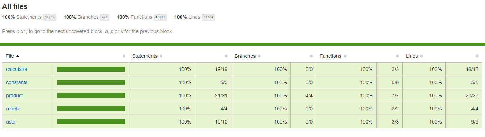

This is an assignment clean the calculator app restructure it in a way one would like to get when working on a software project 

## Steps to run the application on a local system

To Run the application on your local system, perform the following steps:

- Clone this repository on your local machine.
- Open command prompt / terminal.
- Navigate to the Project folder containing `package.json` file.
- Run the following command
    ```
    npm install
    ```
- Once npm install is successful, run the following command
    ```
    npm start
    ```
- If you wish to check the code coverage, you can run the following command:
    ```
    npm run test
    ```

### Unit Test Coverage

To Generate the Coverage report, perform the following steps:

- Open command prompt/terminal on your project's base folder
- Run the following command:
    ```
    npm run test
    ```
- Once the test case execution is complete, open the project folder
- Go to the `coverage` folder
- Open the `index.html` file on your browser. You will get a detailed test coverage report on the browser

Screenshot is available below in the screenshots section

## Commands and their Uses

The above mentioned commands behave as mentioned below:

### `npm install`

Installs all the dependencies required for the application to run

### `npm start`

Runs the app in the development mode.<br>
Open [http://localhost:8080/](http://localhost:8080) to view it in the browser.

The page will reload if you make edits.<br>
The output will be visible in the console.

### `npm run test`

Launches the test runner.<br>

Will generate the coverage on successful completion in both text and html formats


## Screenshots


